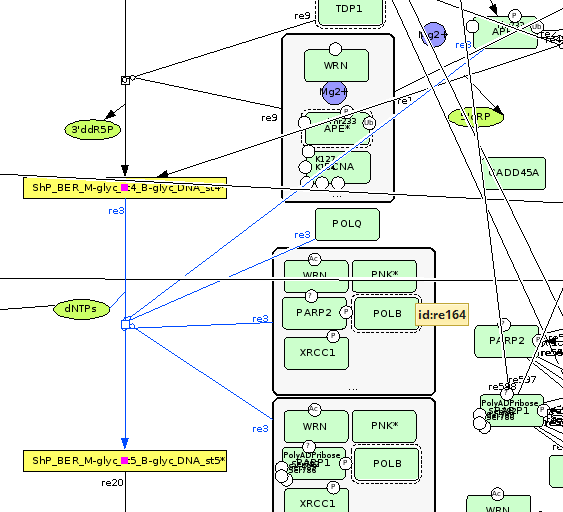

# Hipathia and Disease Maps
Development repository to process the [Disease Maps](http://disease-maps.org/) map with [Hipathia](http://bioconductor.org/packages/release/bioc/html/hipathia.html).

## Install
 - Clone the repository
 - Create a .ENV file
     - Copy `example.env` to `.env`
 -- Change the `maps_dir` environment variable as outlined in `example.env`.
     - Load the project using RStudio
 -- If the requirements are met, `packrat` does everything.

## Requirements
- `R >= 3.5`
- The `SBML` library must be installed and reachable by `R`.

## How to contribute
- Clone the repository.
- Initialize *git-flow*.
- Use the develop branch.
- For the moment, create a notebook following the naming scheme of those already included.
- Once we begin to produce *real* code, follow the standard *git-flow* work-flow.

## Usage
At the moment only exploratory notebooks are included.

### Graph parsing
Notebooks 1 and 2 represent different experiments of the same approach: parse the SBML map with the `read_bml` library, convert to `igraph`, using the  graph representation included in the library, and then work with the induced attributes.

The automatic graph conversion provided by the `read_sbml` library poses serious problems: for instance, the edges pointing to other edges, such as those labeled as modifiers, are missing. In the end most inhibitions are lost during the conversion.

### Metadata parsing
- Reactions labeled as *HETERODIMER_ASSOCIATION* can be removed as they represent complex-formation processes.
- For each reaction that includes modifiers we include one auxiliary node (with input value 1) named `aux`.
    - Each node labeled as *reactant* is connected to `aux` as *input* and *output*, respectively.
    - Each node labeled as *product* is connected to `aux` as output and *input*, respectively.
    - Each node labeled as *modifier* is connected to `aux` as input and output, respectively.

For example, suppose that we have the following sequence `s1,s2/s5,s6/s3,s4` where the nodes are labeled as *reactant/product/modifiers*. Figure 1 shows the resulting network after we apply the previous rules.

Note however that we have provided the most general example, as the number of reactants, products and modifiers can be any number greater than 0.

  
    Figure 1: Modifier network reconstructions.  

## TODO
- Resolve *BOOLEAN_LOGIC_GATE_AND*

  
    Figure 2: boolean_logic_gate_and.  

   

- Resolve *BOOLEAN_LOGIC_GATE_OR*

- Resolve those nodes labeled as *modifier* that are parsed as *CATALYSIS* and are not properly resolved because there is another tag, either *BOOLEAN_LOGIC_GATE_AND* or *BOOLEAN_LOGIC_GATE_OR*, which has not been correctly parsed.

   
- Resolve *protein_X* to *protein_X*

  
    Figure 3: Same protein interactions.  

   
- Resolve modulations

    <table >
    <caption align="bottom"> Figure 4: Modulations re1 </caption>
	    <tr>
    	    <td style="padding:5px">
        	    
      	    </td>
            <td style="padding:5px">
            	
             </td>
        </tr>
    </table>

    <table >
    <caption align="bottom"> Figure 5: Modulations re3 </caption>
	    <tr>
    	    <td style="padding:5px">
        	    
      	    </td>
            <td style="padding:5px">
            	
             </td>
        </tr>
    </table>

   

- Include the module parsing functionality from the graph notebooks.
